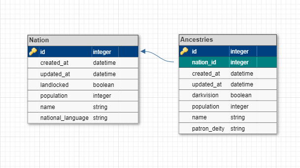

# README

1. run 'bundle install' in terminal
1. run 'rails s'
1. navigate to http://localhost:3000/ancestries or http://localhost:3000/nations
1. navigate thru the site as wanted/needed to see site features.
1. When you want to shut off the server hit 'control + c'
1. Run 'bundle exec rspec for coverage if needed/wanted. It will open tabs showcasing some pages.'

My Schema Diagram:

* Ruby version: 
2.7.4

* System dependencies: 
Rails 5.2.8.1

* Database creation: 
Run 'rails db:create'

* Database initialization: 
Run 'rails db:{drop,create,migrate,seed}'

* How to run the test suite: 
Run 'bundle exec rspec'